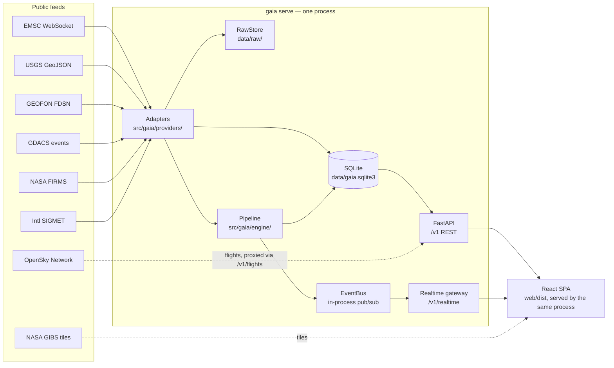

# GAIA Architecture

GAIA is a single local process that ingests public geohazard feeds, fuses them into
canonical events, and serves a live map and API from that state. There is no cloud
service, message broker, or external database — everything below runs on one machine.

## Process topology

## Design principles

- **Local-first.** One process, one SQLite file, one data directory. No account,
  no cloud dependency, no telemetry.
- **Provenance over convenience.** A hazard's source class (official notice,
  multi-source rapid, single-provider, automated signal, or model estimate)
  is carried as data and enforced by an enum, not left to a call site to word
  correctly. See [`domain/enums.py`](../src/gaia/domain/enums.py).
- **Raw payloads are the source of truth.** Every provider response is stored
  unmodified before parsing, so a parser bug can be fixed and replayed against
  history instead of waiting on the provider again.
- **Replay never re-alerts.** Rebuilding canonical events from stored raw data
  reproduces history without re-sending notifications for it.

## Backend (`src/gaia/`)

| Module | Responsibility |
|---|---|
| `config.py` | `pydantic-settings` settings tree (`GAIA_` env prefix, `__` nesting). Resolves the data directory: `data/` next to the repo when run from source, a per-user OS directory (`%LOCALAPPDATA%\GAIA`, `~/Library/Application Support/GAIA`, `$XDG_DATA_HOME/GAIA`) when running from a packaged build. |
| `db.py` | A single guarded SQLite connection (WAL, `synchronous=NORMAL`), plus ISO-8601 datetime helpers. `schema.sql` is applied on init. |
| `domain/` | The vocabulary and data shapes everything else depends on: `enums.py` (hazard types, event state machine, provenance classes and their only-permitted labels), `models.py` (`Observation`, `HazardEvent`, `GeometryFrame`, `AshAdvisory`, `WatchArea`, …), `geo.py` (haversine distance, GeoJSON helpers). |
| `providers/` | One adapter per feed (`emsc.py`, `usgs.py`, `geofon.py`, `gdacs.py`, `firms.py`, `isigmet.py` for the automated international SIGMET volcanic-ash feed, `vaac.py` for manual VAA text ingest, `catalogue.py` for the static volcano seed list). `base.py` defines the adapter contract: an adapter owns transport and provider-specific parsing only — it stores the raw payload, writes an `Observation`, and hands off to the pipeline. It never deduplicates across providers or decides severity. |
| `engine/` | The fusion pipeline: `pipeline.py` orchestrates it end to end; `correlate.py` matches a new observation to an existing event; `fusion.py` merges observations into a canonical event and diffs revisions; `volcano.py` and `wildfire.py` hold hazard-specific clustering/classification (e.g. turning FIRMS thermal detections into a fire cluster); `changes.py` decides whether a diff is material enough to publish; `policy.py` decides whether a change is worth a notification, and composes its text from versioned templates; `impact.py` computes distance-based impact/arrival estimates; `bus.py` is the in-process publish/subscribe replacing a message broker — SQLite's append-only observation and revision tables are the real durable log, so the bus only needs to fan out live updates and hold a short replay backlog for reconnecting clients. |
| `store/` | Repositories over the SQLite tables (`ObservationRepo`, `EventRepo`, `FrameRepo`, `AdvisoryRepo`, `VolcanoRepo`, `WatchAreaRepo`, `ProviderHealthRepo`, `PollStateRepo`, …), `raw.py` (filesystem-backed immutable raw payload store), `secrets.py` (a small JSON file for locally entered credentials, e.g. the FIRMS map key). |
| `runtime.py` | Wires the above into one `Runtime` per process: owns the database, the pipeline, and the adapter tasks; the API reads through it and the ingestion loops write through it. Handles adapter start/stop, manual refresh with per-provider rate limiting, and raw-payload replay. Also holds the OpenSky integration: OAuth2 bearer token caching and a daily request-credit budget (reset at UTC midnight), since the flights overlay is proxied live rather than ingested. |
| `logbuffer.py` | A bounded, thread-safe in-memory ring buffer (`RingBufferHandler`) attached to the root logger by `cli.py`, so recent log records are inspectable from the API/UI regardless of how the process was launched — a packaged executable has no guaranteed place to `tail -f`. |
| `api/` | `app.py` is the FastAPI app factory (lifespan starts/stops the `Runtime`, mounts the built frontend, serves `/healthz`); `routes.py` is the `/v1` REST surface (events, map GeoJSON, impact calculator, volcano catalogue, watch areas, notifications with archive/read state, provider health, manual VAA ingest, manual provider refresh, settings including OpenSky credentials, recent logs via `/v1/logs`, and a `/v1/flights` proxy to OpenSky with a bounding box and a per-day credit budget); `realtime.py` is the `/v1/realtime` WebSocket gateway, which reconnects clients from a sequence number and tells them to resynchronise via REST if the gap is too large for the in-memory backlog. |
| `cli.py` | `gaia init` / `gaia serve` / `gaia replay` / `gaia status`. |

## Frontend (`web/src/`)

A Vite + React + TypeScript SPA, built to `web/dist` and served by the same FastAPI
process (no separate frontend server in production).

- `state/useGaiaData.ts` is the central data hook: fetches events, map frames,
  watch areas, provider health, and notifications, and merges in live updates.
- `state/useRealtime.ts` owns the WebSocket connection to `/v1/realtime`,
  tracking the last sequence number seen and asking `useGaiaData` to refetch
  when the server reports a gap it can't replay.
- `map/MapView.tsx` renders the MapLibre GL map: `layers.ts` and `icons.ts` draw
  hazard markers, `severity.ts` maps event state to the colour-blind-safe
  severity ramp, `geometry.ts` builds ash/impact shapes, `imagery.ts` selects
  between the dark tactical style, Esri aerial imagery, and the NASA GIBS
  real-time basemap, `flights.ts` fetches in-view aircraft from the `/v1/flights`
  proxy for the optional flight-tracking overlay, and `useMapClock.ts` drives the
  time-scrubbing playhead.
- `components/` holds the UI chrome: `TopBar` (basemap and set-location dropdowns,
  icon-triggered Alerts and Watch Area panes, a collapsible left sidebar), `ClockBar`,
  `Legend`, `EventList`/`EventDetail`, `FlightList` (in-view aircraft from the flights
  overlay), `NotificationFeed` (current alerts plus an archived-alerts history view),
  `ProviderHealthPanel`, `SettingsModal` (also hosts the ash advisory paste-in form and
  OpenSky credentials), `LogsPanel` (polls `/v1/logs`, level filter, auto-scroll),
  `WatchAreaPanel`, `ProvenanceBadge` (renders only the labels the backend's provenance
  enum permits), `ImageryAgeBadge`.

## Packaging

`packaging/gaia.spec` builds a PyInstaller onefile executable (Windows) or `.app`
bundle (macOS) containing the backend and the built frontend.
`packaging/gaia_app.py` is the entry point used for that build: it runs `gaia serve`
and opens the default browser, since a double-clicked release has no terminal to read
a startup URL from. Two frozen-build details in the source live outside `packaging/`
because they depend on `sys.frozen`: `config.py`'s per-OS data directory (above), and
`api/app.py`'s resolution of the bundled `web/dist` path via `sys._MEIPASS`.

`scripts/gaia.ps1`/`gaia.sh` start, stop, and restart a packaged build from the
command line: they locate the binary (next to the script, `dist/`, or `PATH`), set
`GAIA_PORT` (the only way to control the port, since the packaged entry point always
runs `gaia serve` regardless of any arguments passed to the executable), auto-bump
past an already-listening port, and recursively kill the process tree on stop.
`scripts/dev.ps1`/`dev.sh` do the same for the separate backend + Vite dev workflow.

## Scope note

This implementation is intentionally a local-first reduction of a larger
multi-service design (originally specified with PostgreSQL/PostGIS, Redis, NATS
JetStream, and object storage). The domain model, safety vocabulary, provenance
rules, and replay guarantees described above are what survived that reduction;
the infrastructure choices did not need to.
