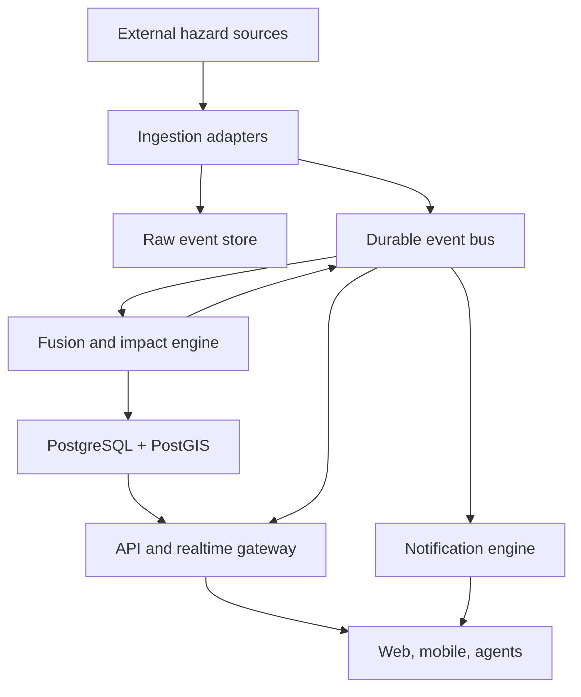
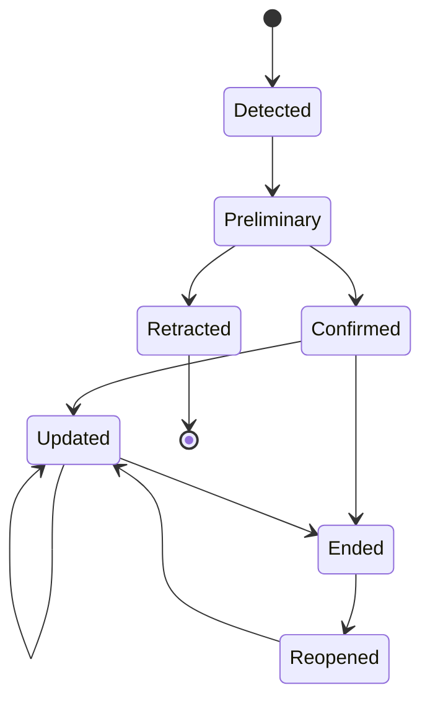

# GeoHazard Early Warning Platform

## Comprehensive implementation specification for volcanic eruptions, volcanic ash, and earthquakes

**Document status:** Implementation-ready architecture and delivery plan  
**Revision:** 1.0  
**Last verified:** 13 September 2026  
**Working name:** GeoHazard Platform

---

## 1. Executive summary

This document specifies a software platform that continuously monitors volcanic-eruption, volcanic-ash, and earthquake data; fuses updates from multiple providers into canonical events; estimates location-specific impact and arrival times; renders the events on an animated geographic map; and sends targeted alerts to subscribed users.

The recommended version-one data stack is:

- **Volcanoes and ash:** GDACS/VAAC as the primary event and ash-advisory source, NASA FIRMS as an independent thermal-anomaly signal, and a maintained volcano catalogue for geospatial correlation.
- **Earthquakes:** EMSC's near-real-time WebSocket as the lowest-latency global programmable feed, USGS GeoJSON and GEOFON FDSN as independent confirmation and enrichment sources.
- **Map:** MapLibre GL JS with deck.gl layers, PostGIS geometries, and open vector tiles.
- **Backend:** Python/FastAPI ingestion and domain services, PostgreSQL/PostGIS, Redis, and NATS JetStream or an equivalent durable event bus.
- **Clients:** a responsive React/TypeScript web application first, followed by native iOS/Android clients using the same API and alert model.

The platform must make a safety-critical distinction:

> Global catalogue feeds provide **rapid detection and estimated arrival**, not authoritative earthquake early warning. The term **Early Warning** must be used only when an alert originates from an approved regional EEW authority or partner feed.

This platform can often inform distant users before shaking reaches them if a fast preliminary earthquake solution arrives in time. It cannot guarantee advance notice, especially close to the epicentre, and it must not present a simplified travel-time estimate as an official warning.

---

## 2. Goals

### 2.1 Primary goals

1. Detect or ingest significant volcanic-eruption signals as early as available free sources permit.
2. Track observed and forecast volcanic-ash areas, altitude bands, direction, speed, and advisory revisions.
3. Ingest global earthquake events with low latency and update them as magnitude, location, depth, and status change.
4. Calculate user-specific distance, estimated shaking arrival, and potential impact using clearly labelled models.
5. Show all active events on a performant geo map with meaningful, time-aware animation.
6. Notify only affected or interested users while preventing alert storms and duplicate notifications.
7. Preserve every source observation, transformation, decision, model version, and delivered alert for auditability.
8. Operate safely when providers fail, publish contradictory values, revise events, or withdraw alerts.

### 2.2 Secondary goals

- Provide historical replay for development, training, and incident review.
- Expose a stable API that future mobile apps, agents, dashboards, and partner systems can consume.
- Support additional hazards later, such as tsunamis, wildfires, severe weather, and landslides.
- Support authoritative Common Alerting Protocol (CAP) ingestion and output when appropriate permissions exist.

### 2.3 Non-goals for version one

- Running a seismic sensor network or detecting P-waves directly.
- Issuing an authoritative global earthquake early warning from catalogue feeds.
- Replacing volcano observatories, VAACs, civil-protection agencies, or national warning systems.
- Producing an original atmospheric-dispersion forecast.
- Guaranteeing that an alert arrives before a hazard.
- Advising aircraft routing or certifying airspace safety.
- Predicting earthquakes before rupture begins.

---

## 3. Safety and product-language policy

This is a safety-relevant application. Its scientific and product vocabulary must be enforced in code, not left to copywriting convention.

### 3.1 Alert provenance classes

| Class | Meaning | Permitted user-facing label |
|---|---|---|
| `AUTHORITATIVE_EEW` | Direct message from an approved regional EEW authority or licensed partner feed | **Earthquake Early Warning** |
| `AUTHORITATIVE_NOTICE` | Official notice or advisory published after detection | **Official notice** or **Official advisory** |
| `MULTISOURCE_RAPID` | Preliminary event fused from independent near-real-time catalogues | **Rapid earthquake alert** |
| `SINGLE_SOURCE_RAPID` | Preliminary event from one trusted catalogue | **Preliminary earthquake report** |
| `AUTOMATED_SIGNAL` | FIRMS thermal anomaly, SACS plume signal, community sensor trigger, or similar | **Possible event — automated detection** |
| `MODEL_ESTIMATE` | Platform-derived wave ETA, impact zone, interpolation, or trajectory | **Estimate** or **modelled** |

### 3.2 Mandatory UI rules

- Always show the publishing source and original issue time.
- Show both event origin time and the time the platform received it.
- Label preliminary magnitude, location, and depth as changeable.
- Display `Estimated shaking arrival` for platform calculations; never relabel it `official warning`.
- Distinguish observed ash polygons from forecast polygons with different visual styles.
- Never show a green `safe` state. Use `No active alert found` and show the data freshness.
- Include a persistent instruction to follow local authorities.
- When data are stale, hide countdowns and replace them with `Data delayed`.
- A cancelled or deleted event must remain visible in history with its cancellation state.

### 3.3 Mandatory notification rules

- Every alert includes hazard, location, severity, source class, issue time, and a direct map link.
- Urgent notifications contain one short action statement sourced from an approved authority or a pre-reviewed generic template.
- No generative AI may create or modify life-safety instructions at delivery time.
- Model-generated summaries may explain context only and must never alter severity, affected area, ETA, or official instructions.

---

## 4. Users and main use cases

### 4.1 Public user

- See nearby earthquakes, active eruptions, and ash movement.
- Follow a home location, current location, family locations, or named geographic areas.
- Receive threshold-based notifications.
- Open a map directly at the relevant event and current animation time.
- Understand whether the information is official, preliminary, or estimated.

### 4.2 Analyst or operations user

- Inspect raw source observations and the canonical fused event.
- Compare revisions across EMSC, USGS, GEOFON, GDACS, VAAC, and FIRMS.
- Review deduplication, confidence, severity, and notification decisions.
- Replay an event exactly as it unfolded.
- Suppress a faulty adapter or pause notification delivery without stopping ingestion.

### 4.3 Administrator

- Configure provider credentials, polling intervals, thresholds, feature flags, and geographic coverage.
- Manage authoritative-source allowlists.
- Inspect provider health and data freshness.
- Audit all changes to alert policies.

### 4.4 Machine client or agent

- Query active events and risk for a location.
- Subscribe to canonical event updates through WebSocket, SSE, webhook, or push.
- Retrieve normalized GeoJSON and provenance without parsing provider-specific formats.

---

## 5. Functional requirements

### 5.1 Event ingestion

- Maintain persistent connections where a real-time stream exists.
- Poll HTTP feeds with conditional requests, jitter, backoff, and rate-limit compliance.
- Store the exact raw payload before normalization.
- Validate schema, coordinates, timestamps, and geometry.
- Normalize all timestamps to UTC while preserving the source representation.
- Detect source updates, deletions, cancellations, and retractions.
- Reprocess stored raw messages after parser fixes.

### 5.2 Event fusion

- Correlate observations that refer to the same physical event.
- Preserve each provider's identifier and revision sequence.
- Select a canonical value per field using source authority, freshness, completeness, and quality.
- Recalculate impact whenever magnitude, location, depth, ash geometry, altitude, or status changes materially.
- Produce an explainable confidence score and reason codes.

### 5.3 Location impact

- Support points, circles, administrative areas, routes, and custom polygons.
- Compute distance from an event or hazard geometry.
- Estimate P- and S-wave arrival for rapid earthquake reports.
- Intersect watched locations with observed and forecast ash polygons.
- Generate future `enter`, `inside`, and `exit` windows for forecast ash.
- Apply user thresholds and quiet-hour policies without suppressing imminent high-severity alerts.

### 5.4 Map and animation

- Display clustered global events and detailed local layers.
- Animate ash movement over advisory-valid times.
- Animate approximate P- and S-wave fronts for fresh earthquakes.
- Display observed/modelled shaking or intensity zones where available.
- Provide live mode, pause, replay, playback speed, and a time scrubber.
- Support layer toggles, legend, provenance, and data-age indicators.
- Respect reduced-motion accessibility settings.

### 5.5 Notification delivery

- Support mobile push, web push, email, webhooks, and in-app updates.
- Deduplicate provider updates into a controlled event-notification lifecycle.
- Send material revisions, escalations, cancellations, and all-clear/expiry messages when justified.
- Record provider acknowledgement, delivery result, and user interaction.

---

## 6. Recommended architecture

Start with a modular architecture that can run as four independently scalable processes. Avoid dozens of microservices during the MVP; low-latency reliability is helped more by simple ownership and excellent replay than by service count.



### 6.1 Deployable processes

| Process | Responsibility | Scaling pattern |
|---|---|---|
| `ingest-worker` | Provider connections, polling, validation, raw persistence, normalization | One active lease per provider/partition |
| `hazard-engine` | Deduplication, fusion, state machine, impact and forecast calculations | Partition by canonical event ID |
| `api-gateway` | REST, GeoJSON, WebSocket/SSE, authentication, user settings | Horizontal/stateless |
| `notification-worker` | Policy evaluation, deduplication, push/email/webhook delivery | Partition by recipient/channel |

### 6.2 Core infrastructure

| Component | Recommendation | Reason |
|---|---|---|
| Application language | Python 3.12+ for ingestion/science; TypeScript for web | Strong geospatial/scientific ecosystem and shared client types |
| API | FastAPI + Pydantic | Async I/O, OpenAPI, validation |
| Primary database | PostgreSQL + PostGIS | Transactions, temporal history, geometry intersection, spatial indexes |
| Event bus | NATS JetStream | Low-latency durable streams, replay, manageable operations |
| Cache/coordination | Redis | Provider leases, hot event cache, rate limits, notification locks |
| Object storage | S3-compatible bucket | Immutable raw payloads, larger GeoJSON, replay archives |
| Web frontend | React + TypeScript + Vite | Mature ecosystem and fast client delivery |
| Map | MapLibre GL JS + deck.gl | Open WebGL map, GeoJSON/vector-tile support, GPU layers and animation |
| Geometry processing | Shapely, PyProj, GeoPandas, Turf.js | Robust server and client geospatial operations |
| Observability | OpenTelemetry + Prometheus/Grafana + structured logs | Cross-service latency and incident traceability |

### 6.3 Why a durable event bus is required

Every normalized observation and canonical update must be replayable. If the fusion algorithm changes, the platform should rebuild canonical history from stored raw observations without fetching providers again. Notification side effects must not repeat during replay unless explicitly enabled in a sandbox.

Recommended subjects:

```text
raw.volcano.gdacs
raw.volcano.firms
raw.ash.vaac
raw.earthquake.emsc
raw.earthquake.usgs
raw.earthquake.geofon
normalized.volcano
normalized.ash
normalized.earthquake
canonical.event.created
canonical.event.updated
canonical.event.cancelled
impact.updated
notification.requested
notification.delivered
```

---

## 7. External data sources

Provider adapters must be isolated behind configuration and contract tests. Never let provider field names leak into the canonical API.

### 7.1 Volcanic-eruption and ash sources

| Source | Role | Access pattern | Expected latency | Version-one status |
|---|---|---|---|---|
| GDACS event API/feed | Active volcanic events and humanitarian context | REST/GeoJSON polling | Near-real-time but not guaranteed | Required |
| GDACS VAAC endpoints | VAA bulletin, ash attributes, associated geometry | REST polling | Depends on source VAAC | Required where endpoint coverage is sufficient |
| VAAC bulletins | Authoritative aviation ash advisory text and forecast geometry | Provider-specific API/feed | Often tens of minutes; varies | Optional direct fallback |
| NASA FIRMS | Thermal anomalies near known volcanoes | REST CSV polling; free map key | Depends on satellite overpass and product | Required independent signal |
| SACS | SO2/ash plume signal and movement context | Email/web/data integration | Satellite-dependent | Phase two |
| Volcano catalogue | Known volcano identity, coordinates, aliases | Scheduled dataset refresh | Not event-critical | Required |

#### GDACS

GDACS documents free API access with attribution and GeoJSON event extraction. Its event search endpoint follows this pattern:

```text
GET https://www.gdacs.org/gdacsapi/api/events/geteventlist/SEARCH
    ?eventlist=VO
    &fromdate=YYYY-MM-DD
    &todate=YYYY-MM-DD
    &pagenumber=1
    &pagesize=100
```

The adapter must treat the exact VAAC method parameters as provider configuration generated from the current GDACS Swagger definition. Candidate methods include:

```text
/api/Vaac/getvaacdata
/api/Vaac/getvaacbulletin
/api/Vaac/getvaacbulletintext
/api/Vaac/getgeometry
```

Do not fail the entire eruption pipeline if a VAAC geometry endpoint changes. Store the raw bulletin, mark geometry unavailable, and raise an adapter-health alert.

Important limitation: GDACS states that its volcano information is primarily based on VAAs and Smithsonian weekly reports, and that its information is indicative. It should not be the sole basis for life-safety decisions.

#### NASA FIRMS

Use FIRMS only as an automated signal, not as proof of eruption. The area endpoint format is:

```text
GET https://firms.modaps.eosdis.nasa.gov/api/area/csv/
    {MAP_KEY}/{SOURCE}/{WEST,SOUTH,EAST,NORTH}/{DAY_RANGE}
```

Recommended sources:

```text
VIIRS_NOAA21_NRT
VIIRS_NOAA20_NRT
VIIRS_SNPP_NRT
MODIS_NRT
```

Query bounding boxes around volcano-dense regions rather than the whole world when practical. Correlate detections to known volcanoes using a configurable distance, initially 10 km, then learn volcano-specific baselines.

Store at least:

- acquisition date and time;
- latitude and longitude;
- instrument and satellite;
- confidence category;
- fire radiative power (FRP);
- day/night indicator;
- source product and ingestion time.

Potential false signals include wildfires, industrial heat, lava from already-known activity, and geolocation error. Never publish an eruption notification from one FIRMS pixel alone.

### 7.2 Earthquake sources

| Source | Role | Access pattern | Expected latency | Version-one status |
|---|---|---|---|---|
| EMSC SeismicPortal | Fast global preliminary event stream | SockJS/WebSocket JSON | Near-real-time | Primary |
| USGS | Independent global confirmation and enrichment | GeoJSON every minute | Feed updated every minute | Required |
| GEOFON | Independent global/regional catalogue | FDSN Event REST | Near-real-time catalogue | Required |
| Regional EEW authority | True P-wave-based warning | Partner-specific stream/CAP | Seconds | Optional authoritative integration |
| Community station triggers | Experimental low-latency signal | MQTT/SSE/provider-specific | Seconds to minutes | Research only |

#### EMSC WebSocket

Official endpoints currently documented by SeismicPortal:

```text
SockJS:    https://www.seismicportal.eu/standing_order
WebSocket: wss://www.seismicportal.eu/standing_order/websocket
```

Messages contain an action plus GeoJSON-like event data. The adapter must:

- maintain ping/heartbeat and exponential reconnect;
- persist the last received message time;
- normalize insert and update actions;
- tolerate new fields;
- reject impossible coordinates or timestamps without closing the stream;
- backfill from the EMSC FDSN service after reconnect to close gaps.

EMSC documents WebSocket data under CC BY 4.0. Preserve attribution in event metadata and the UI.

#### USGS GeoJSON

For global recent events:

```text
https://earthquake.usgs.gov/earthquakes/feed/v1.0/summary/all_hour.geojson
https://earthquake.usgs.gov/earthquakes/feed/v1.0/summary/2.5_day.geojson
https://earthquake.usgs.gov/earthquakes/feed/v1.0/summary/4.5_day.geojson
```

The recent feeds are documented as updated every minute. Use the detail URL on each feature to retrieve richer products only when necessary. Prefer conditional GET and compare each event's `updated` timestamp.

#### GEOFON FDSN

Base service:

```text
https://geofon.gfz-potsdam.de/fdsnws/event/1/query
```

Request a narrow moving window and supported output such as `format=json` if available, otherwise CSV or QuakeML. The official service provides origin and magnitude estimates and supports hypocentre, time, and magnitude filters. Do not depend on `updatedafter`; the GEOFON implementation documents it as unavailable.

### 7.3 Source configuration contract

```yaml
providers:
  emsc:
    enabled: true
    websocket_url: wss://www.seismicportal.eu/standing_order/websocket
    stale_after_seconds: 90
    reconnect_max_seconds: 60
  usgs:
    enabled: true
    feed_url: https://earthquake.usgs.gov/earthquakes/feed/v1.0/summary/all_hour.geojson
    poll_seconds: 60
  geofon:
    enabled: true
    base_url: https://geofon.gfz-potsdam.de/fdsnws/event/1/query
    poll_seconds: 60
    lookback_minutes: 30
  gdacs:
    enabled: true
    poll_seconds: 120
    attribution: Global Disaster Awareness and Coordination System, GDACS
  firms:
    enabled: true
    map_key_secret: FIRMS_MAP_KEY
    poll_seconds: 900
    volcano_radius_km: 10
```

Every URL and interval must be configurable without a code release.

---

## 8. Canonical domain model

### 8.1 Hazard event

```json
{
  "id": "evt_01J...",
  "hazardType": "EARTHQUAKE",
  "state": "ACTIVE",
  "provenanceClass": "MULTISOURCE_RAPID",
  "quality": "PRELIMINARY",
  "originTime": "2026-09-13T19:41:17.421Z",
  "firstObservedAt": "2026-09-13T19:41:31.003Z",
  "firstIngestedAt": "2026-09-13T19:41:31.191Z",
  "lastUpdatedAt": "2026-09-13T19:42:07.012Z",
  "revision": 4,
  "location": {
    "type": "Point",
    "coordinates": [22.11, 38.32, 12.0]
  },
  "summary": {
    "magnitude": 6.1,
    "magnitudeType": "Mw",
    "depthKm": 12.0,
    "place": "Central Greece"
  },
  "confidence": 0.97,
  "confidenceReasons": [
    "THREE_INDEPENDENT_SOURCES",
    "SPATIAL_MATCH_WITHIN_18_KM",
    "ORIGIN_TIME_MATCH_WITHIN_9_SECONDS"
  ],
  "sourceRefs": [
    {"provider": "EMSC", "sourceId": "...", "revision": 2},
    {"provider": "USGS", "sourceId": "...", "revision": 1},
    {"provider": "GEOFON", "sourceId": "...", "revision": 1}
  ]
}
```

### 8.2 Ash advisory

```json
{
  "eventId": "evt_01J...",
  "advisoryId": "vaa_tokyo_20260913_004",
  "volcanoId": "v_kanlaon",
  "issueTime": "2026-09-13T23:59:00Z",
  "observationTime": "2026-09-13T23:40:00Z",
  "status": "ACTIVE",
  "source": "TOKYO_VAAC",
  "altitude": {
    "bottomFlightLevel": 100,
    "topFlightLevel": 300,
    "bottomMeters": 3048,
    "topMeters": 9144
  },
  "movement": {
    "directionDegrees": 135,
    "directionText": "SE",
    "speedKnots": 20
  },
  "frames": [
    {"kind": "OBSERVED", "validTime": "2026-09-13T23:40:00Z", "geometryRef": "..."},
    {"kind": "FORECAST", "leadHours": 6, "validTime": "2026-09-14T05:40:00Z", "geometryRef": "..."},
    {"kind": "FORECAST", "leadHours": 12, "validTime": "2026-09-14T11:40:00Z", "geometryRef": "..."},
    {"kind": "FORECAST", "leadHours": 18, "validTime": "2026-09-14T17:40:00Z", "geometryRef": "..."}
  ],
  "rawBulletinRef": "s3://...",
  "parserVersion": "vaa-parser/1.0.0"
}
```

### 8.3 Observation envelope

All adapters emit the same envelope:

```json
{
  "messageId": "msg_01J...",
  "provider": "EMSC",
  "sourceId": "20260913_...",
  "sourceRevision": "updated:1726256527000",
  "hazardType": "EARTHQUAKE",
  "action": "UPSERT",
  "sourceIssuedAt": "2026-09-13T19:42:07Z",
  "observedAt": "2026-09-13T19:41:17Z",
  "ingestedAt": "2026-09-13T19:42:07.112Z",
  "schemaVersion": "observation/1.0",
  "parserVersion": "emsc/1.0.0",
  "rawPayloadSha256": "...",
  "normalized": {},
  "validationWarnings": []
}
```

---

## 9. Persistence model

Use append-only observation and revision tables plus a materialized current-event record.

### 9.1 Main tables

```sql
CREATE EXTENSION IF NOT EXISTS postgis;

CREATE TABLE source_observation (
    id                  uuid PRIMARY KEY,
    provider            text NOT NULL,
    source_id           text NOT NULL,
    source_revision     text NOT NULL,
    hazard_type         text NOT NULL,
    action              text NOT NULL,
    source_issued_at    timestamptz,
    observed_at         timestamptz,
    ingested_at         timestamptz NOT NULL DEFAULT now(),
    parser_version      text NOT NULL,
    raw_object_key      text NOT NULL,
    raw_sha256          text NOT NULL,
    normalized_payload  jsonb NOT NULL,
    validation_warnings jsonb NOT NULL DEFAULT '[]',
    UNIQUE (provider, source_id, source_revision)
);

CREATE TABLE hazard_event (
    id                   uuid PRIMARY KEY,
    hazard_type          text NOT NULL,
    state                text NOT NULL,
    provenance_class     text NOT NULL,
    quality              text NOT NULL,
    origin_time          timestamptz,
    first_observed_at    timestamptz,
    first_ingested_at    timestamptz NOT NULL,
    last_updated_at      timestamptz NOT NULL,
    revision             integer NOT NULL,
    geom                 geometry(GeometryZ, 4326),
    magnitude            double precision,
    magnitude_type       text,
    depth_km             double precision,
    confidence           double precision NOT NULL,
    current_payload      jsonb NOT NULL
);

CREATE INDEX hazard_event_geom_gix ON hazard_event USING gist (geom);
CREATE INDEX hazard_event_time_idx ON hazard_event (origin_time DESC);
CREATE INDEX hazard_event_active_idx ON hazard_event (hazard_type, state)
    WHERE state = 'ACTIVE';

CREATE TABLE hazard_event_revision (
    event_id             uuid NOT NULL REFERENCES hazard_event(id),
    revision             integer NOT NULL,
    changed_at           timestamptz NOT NULL,
    decision_version     text NOT NULL,
    snapshot             jsonb NOT NULL,
    change_set           jsonb NOT NULL,
    PRIMARY KEY (event_id, revision)
);

CREATE TABLE event_source_link (
    event_id             uuid NOT NULL REFERENCES hazard_event(id),
    observation_id       uuid NOT NULL REFERENCES source_observation(id),
    match_score          double precision NOT NULL,
    match_reasons        jsonb NOT NULL,
    PRIMARY KEY (event_id, observation_id)
);

CREATE TABLE hazard_geometry_frame (
    id                   uuid PRIMARY KEY,
    event_id             uuid NOT NULL REFERENCES hazard_event(id),
    geometry_type        text NOT NULL,
    frame_kind           text NOT NULL,
    valid_time           timestamptz NOT NULL,
    lower_altitude_m     double precision,
    upper_altitude_m     double precision,
    geom                 geometry(Geometry, 4326) NOT NULL,
    source_provider      text NOT NULL,
    source_ref           text NOT NULL,
    properties           jsonb NOT NULL DEFAULT '{}'
);

CREATE INDEX hazard_frame_geom_gix ON hazard_geometry_frame USING gist (geom);
CREATE INDEX hazard_frame_time_idx ON hazard_geometry_frame (event_id, valid_time);
```

### 9.2 Subscription tables

```sql
CREATE TABLE watch_area (
    id                   uuid PRIMARY KEY,
    user_id              uuid NOT NULL,
    name                 text NOT NULL,
    geom                 geometry(Geometry, 4326) NOT NULL,
    hazard_types         text[] NOT NULL,
    threshold_policy     jsonb NOT NULL,
    enabled              boolean NOT NULL DEFAULT true
);

CREATE INDEX watch_area_geom_gix ON watch_area USING gist (geom);

CREATE TABLE alert_decision (
    id                   uuid PRIMARY KEY,
    event_id             uuid NOT NULL,
    event_revision       integer NOT NULL,
    watch_area_id        uuid NOT NULL,
    policy_version       text NOT NULL,
    decision             text NOT NULL,
    reason_codes         jsonb NOT NULL,
    computed_impact      jsonb NOT NULL,
    created_at           timestamptz NOT NULL DEFAULT now(),
    UNIQUE (event_id, event_revision, watch_area_id, policy_version)
);

CREATE TABLE notification_delivery (
    id                   uuid PRIMARY KEY,
    alert_decision_id    uuid NOT NULL REFERENCES alert_decision(id),
    channel              text NOT NULL,
    destination_hash     text NOT NULL,
    template_version     text NOT NULL,
    idempotency_key      text NOT NULL UNIQUE,
    provider_message_id  text,
    status               text NOT NULL,
    attempted_at         timestamptz,
    delivered_at         timestamptz,
    opened_at            timestamptz,
    failure_code         text
);
```

### 9.3 Retention

- Raw payloads: immutable, minimum one year; longer for audit/research where licensing permits.
- Normalized observations and canonical revisions: indefinite unless policy requires deletion.
- Precise personal locations: retain only while the user enables the watch area.
- Notification destinations: encrypt; log only a salted hash.
- Provider health metrics: 13 months to reveal seasonal patterns.

---

## 10. Ingestion implementation

### 10.1 Adapter interface

```python
from typing import AsyncIterator, Protocol

class HazardAdapter(Protocol):
    name: str

    async def healthcheck(self) -> dict: ...
    async def stream(self) -> AsyncIterator[bytes]: ...
    async def parse(self, raw: bytes) -> list[dict]: ...
    async def backfill(self, start_utc, end_utc) -> AsyncIterator[bytes]: ...
```

Each adapter owns transport and provider parsing only. It must not decide severity, deduplicate across providers, or send alerts.

### 10.2 Raw-first processing

1. Receive bytes and transport metadata.
2. Calculate SHA-256.
3. Persist raw bytes to object storage using a deterministic key.
4. Insert an ingestion ledger entry.
5. Parse and validate.
6. Persist normalized observation.
7. Publish the observation envelope.
8. Acknowledge the source/event-bus message only after durable persistence.

Suggested object key:

```text
raw/{provider}/{yyyy}/{mm}/{dd}/{source_id}/{received_timestamp}_{sha256}.{ext}
```

### 10.3 Polling controls

- Use `ETag` and `If-Modified-Since` when supported.
- Add 0–10% jitter to avoid synchronized requests.
- Retry network errors with exponential backoff and a maximum interval.
- Do not retry permanent 4xx responses except 408 and 429.
- Honour `Retry-After`.
- Open a circuit breaker after repeated failures while continuing health probes.
- Generate a stale-source incident when data age crosses provider-specific limits.

### 10.4 Clock and latency fields

Record separate timestamps:

- `origin_time`: physical event start where reported;
- `observation_time`: satellite, station, or analyst observation time;
- `source_issue_time`: provider publication time;
- `ingested_at`: platform receipt time;
- `processed_at`: canonical update completion time;
- `notified_at`: delivery submission time.

This allows the platform to measure where latency occurred rather than reporting one ambiguous delay.

---

## 11. Event correlation, fusion, and revision handling

### 11.1 Earthquake candidate matching

Generate candidates within a moving time and space window. Initial defaults:

- origin-time difference ≤ 120 seconds;
- epicentral distance ≤ 150 km;
- magnitude difference ≤ 1.2;
- hazard type is earthquake;
- neither observation explicitly identifies a different event.

Compute a match score:

```text
score = 0.45 * time_similarity
      + 0.35 * distance_similarity
      + 0.15 * magnitude_similarity
      + 0.05 * provider_id_link
```

Require `score >= 0.72` for automatic linking. Values from `0.55` to `0.72` remain candidates until another observation resolves ambiguity. Thresholds must be trained against historical multi-provider data, not assumed permanent.

Avoid merging large aftershocks with the main shock. If two source observations from the same provider coexist with distinct IDs, treat that as strong evidence for separate events.

### 11.2 Volcano matching

Resolve volcano identity in this order:

1. provider volcano identifier;
2. normalized name and aliases;
3. coordinates within volcano-specific radius;
4. responsible VAAC and region;
5. manual alias table.

An ash advisory may cover multiple polygons and altitude bands. Preserve all of them; do not flatten into one bounding box.

### 11.3 Canonical field selection

For each field, rank observations by:

1. source authority for that field;
2. quality/final status;
3. source issue time and freshness;
4. uncertainty and completeness;
5. internal quality flags.

Examples:

- A VAAC polygon outranks a platform extrapolation for ash geometry.
- An authoritative regional magnitude may outrank a global preliminary magnitude.
- A newer automatic estimate does not automatically replace an older reviewed estimate.

Store the winning observation ID per canonical field so the API can explain where each value came from.

### 11.4 Event state machine



Domain states exposed by the API:

```text
DETECTED
PRELIMINARY
CONFIRMED
UPDATED
ENDED
RETRACTED
```

### 11.5 Material-change rules

A new revision does not automatically justify a notification. Suggested earthquake triggers:

- magnitude crosses a configured threshold;
- magnitude changes by at least 0.3;
- epicentre moves enough to change impact or distance materially;
- depth changes enough to change the impact estimate;
- provenance upgrades from single-source to multisource or authoritative;
- tsunami flag changes;
- event is retracted.

Suggested volcano/ash triggers:

- eruption status escalates;
- observed ash appears or disappears;
- top altitude changes by at least one configured flight-level band;
- movement direction changes materially;
- a forecast polygon begins intersecting a watch area;
- advisory is cancelled or replaced.

---

## 12. Earthquake impact and arrival-time model

### 12.1 MVP travel-time estimate

For a user at surface great-circle distance `d` kilometres from an earthquake of depth `h` kilometres:

```text
hypocentral_distance = sqrt(d² + h²)
P_arrival_seconds = hypocentral_distance / Vp
S_arrival_seconds = hypocentral_distance / Vs
```

Initial educational velocities:

```text
Vp = 6.0 km/s
Vs = 3.5 km/s
```

Estimated remaining warning at processing time:

```text
remaining_seconds = S_arrival_seconds
                  - (current_time - origin_time)
                  - delivery_margin_seconds
```

Use a conservative delivery margin of 2–5 seconds. If the remaining value is ≤ 0, do not show a negative countdown; show `Shaking may already have arrived`.

This constant-velocity model is suitable only for an MVP visual estimate. It does not represent local crustal structure, rupture propagation, basin amplification, finite fault geometry, or uncertainty in a preliminary hypocentre.

### 12.2 Production travel-time upgrade

Replace constant velocities with a validated travel-time library such as TauP using an accepted Earth model, then add regional velocity models where available. Return an interval rather than false precision:

```json
{
  "sWaveArrival": {
    "estimate": "2026-09-13T19:42:14Z",
    "earliest": "2026-09-13T19:42:10Z",
    "latest": "2026-09-13T19:42:21Z",
    "model": "iasp91/taup",
    "quality": "MODELLED"
  }
}
```

### 12.3 Shaking severity

Do not infer Modified Mercalli Intensity from magnitude and radius alone in a safety-facing production feature. Preferred order:

1. provider ShakeMap or official intensity product;
2. validated ground-motion prediction equation appropriate to region and tectonic setting;
3. clearly labelled rough screening estimate for internal prioritization only.

Site conditions matter. A later phase should include Vs30/site amplification and building vulnerability only after scientific validation.

### 12.4 Alert eligibility example

```text
IF provenance = AUTHORITATIVE_EEW
   AND predicted_intensity >= configured_authority_threshold
THEN urgent early-warning notification

ELSE IF magnitude >= 5.0
    AND user_distance_km <= radius_for(magnitude, depth)
    AND confidence >= 0.70
THEN rapid earthquake alert

ELSE IF user explicitly follows the region/event
THEN informational update
```

Thresholds must be region-aware and change-controlled. Do not silently ship a new threshold model.

---

## 13. Volcano and ash analysis

### 13.1 Thermal anomaly scoring

For every known volcano, maintain a rolling baseline by sensor, season, viewing conditions, and day/night when enough observations exist.

Candidate features:

- distance to volcano vent;
- FRP and change from local baseline;
- number of adjacent pixels;
- persistence across satellite passes;
- agreement across VIIRS/MODIS sensors;
- concurrent GDACS/VAAC event;
- concurrent SO2 or ash indication;
- nearby wildfire density;
- local industrial heat-source exclusion.

Initial deterministic classification:

| Rule | Classification |
|---|---|
| One isolated FIRMS pixel only | `AUTOMATED_SIGNAL`, no public eruption alert |
| Repeated/clustered anomaly near known volcano | `POSSIBLE_ERUPTION`, analyst/in-app only |
| Thermal anomaly + independent plume/official report | `LIKELY_ERUPTION` |
| VAAC or observatory confirmation | `CONFIRMED_ERUPTION` |

Start with explainable rules. Train a model only after accumulating labelled historical observations and measuring false positives by volcano type.

### 13.2 VAA parsing

The parser must extract when present:

- advisory centre and advisory number;
- volcano name, identifier, and coordinates;
- eruption and observation time;
- aviation colour code/status;
- observed ash polygon(s);
- base and top altitude/flight level;
- movement direction and speed;
- +6, +12, and +18-hour forecast polygons;
- next advisory time;
- no-ash, not-identifiable, cancelled, or final-advisory status;
- raw bulletin text and parser warnings.

Never discard unparsed text. A parse with missing geometry remains a valid advisory record with `geometryQuality = UNAVAILABLE`.

### 13.3 Ash intersection

For each geometry frame and watch area:

```sql
SELECT ST_Intersects(frame.geom, watch.geom)
FROM hazard_geometry_frame frame
JOIN watch_area watch ON watch.enabled
WHERE frame.event_id = :event_id;
```

For point locations, optionally buffer the point using an uncertainty/safety radius before intersection. Return:

- first forecast entry time;
- last forecast exit time;
- altitude bands;
- forecast lead time;
- source issue time;
- source and model quality.

Do not claim surface ashfall from an aviation ash-cloud polygon. Airborne ash and ground ashfall are different hazards.

---

## 14. Geo map and animation subsystem

### 14.1 Recommended stack

- **MapLibre GL JS** renders the vector base map and standard GeoJSON layers.
- **deck.gl** renders high-volume, GPU-accelerated hazard layers and time-based animation.
- **PostGIS** performs authoritative server-side spatial queries.
- **Turf.js** performs lightweight client-side display calculations only.
- **PMTiles** can package self-hosted vector tiles into range-requestable archives.
- **OpenStreetMap-derived vector tiles** provide the base map, subject to provider usage terms and attribution.

Do not use the public OpenStreetMap tile server as an unbounded production tile backend. Use a compliant tile provider or host generated tiles.

### 14.2 Required map layers

Layer order, bottom to top:

1. base vector map;
2. optional terrain/hillshade;
3. administrative boundaries and watch areas;
4. forecast shaking/intensity zones;
5. ash forecast polygons;
6. observed ash polygons;
7. animated ash movement paths/particles;
8. earthquake P/S-wave fronts;
9. volcano and earthquake symbols;
10. user/watch locations;
11. labels, countdown, selection, and alert focus.

### 14.3 Visual semantics

| Layer | Style | Meaning |
|---|---|---|
| Observed ash | Solid dark-grey/brown fill, strong border | Provider-observed or analysed ash |
| Forecast ash | Hatched or translucent amber fill, dashed border | Future provider forecast |
| Platform interpolation | Lighter translucent fill, dotted border | Visual interpolation only |
| P-wave front | Thin cool-colour ring | Approximate faster wavefront |
| S-wave front | Thicker orange/red ring | Approximate strong-wave arrival, not intensity |
| Authoritative EEW zone | Authority-defined style and badge | Official warning geometry |
| Preliminary earthquake | Pulsing hollow marker | Location may change |
| Confirmed earthquake | Solid marker | Multisource/reviewed state |
| Thermal anomaly | Small square/heat pixel | Satellite heat signal, not confirmed eruption |

All colours require redundant shape/pattern cues for colour-blind accessibility.

### 14.4 Map time model

The map has one authoritative clock:

```ts
type MapClock = {
  mode: 'LIVE' | 'PAUSED' | 'REPLAY';
  displayTime: string;
  playbackRate: 0.25 | 0.5 | 1 | 2 | 4 | 8 | 16;
  windowStart: string;
  windowEnd: string;
};
```

Every animated layer reads `displayTime`. This prevents the ash layer, earthquake rings, and event list from showing different moments.

### 14.5 Ash animation

The goal is to communicate advisory evolution without inventing forecast precision.

For each advisory frame:

1. Render the exact observed/forecast polygon at its valid time.
2. Between frames, crossfade exact polygons.
3. Morph polygon boundaries only when topology and ring correspondence are stable.
4. If topology changes, never force vertex interpolation; use crossfade or stepped animation.
5. Draw a centroid path with time stamps for observed, +6h, +12h, and +18h frames.
6. If movement direction/speed exists, animate sparse particles within the polygon as an **illustrative flow** and label it as such.
7. Stop particles and grey the layer when the advisory becomes stale.

Recommended deck.gl layers:

- `GeoJsonLayer` for observed and forecast polygons;
- `PathLayer` or `TripsLayer` for the time-indexed centroid path;
- `ScatterplotLayer` or a custom shader layer for particles;
- `TextLayer` for altitude and valid-time labels.

### 14.6 Earthquake wave animation

For a simple surface ring at elapsed time `t`, event depth `h`, and wave speed `v`:

```text
travelled_distance = v * t
surface_radius = sqrt(max(0, travelled_distance² - h²))
```

Draw separate P and S rings. This is a geometric visualization of a simplified velocity model, not a prediction of shaking strength.

Rules:

- Anchor animation to event origin time, not ingestion time.
- If the event is already old, start at the correct current radius rather than replaying from zero.
- Hide the real-time countdown when source latency or event-time uncertainty exceeds policy.
- Fade wave rings after the useful window.
- Show estimated arrival at a selected location as a time interval.
- If an official EEW wavefront/product exists, render it separately and suppress the platform approximation by default.

### 14.7 Event clustering and level of detail

- Zoom 0–3: aggregate by geospatial cell and hazard type.
- Zoom 4–7: display significant individual events and clusters.
- Zoom 8+: display full geometry, source points, altitude labels, and watch areas.
- Use vector tiles for historical events or large geometries.
- Use live GeoJSON only for the small active-event set.

### 14.8 Map interaction

- Selecting an event opens a detail panel without obscuring the hazard geometry.
- `Fit to event` includes all active polygons and forecast frames.
- Hover/tap shows time, source, quality, altitude/depth, and data age.
- A legend changes as layers appear or become stale.
- A `Why am I seeing this?` panel explains threshold and watch-area intersection.
- Deep links encode event ID and selected time, not raw provider IDs.

### 14.9 Accessibility and performance

- Respect `prefers-reduced-motion`; replace pulsing/moving effects with stepped frames.
- Keep alert information available outside the map for screen readers.
- Never communicate severity by colour alone.
- Maintain 30 FPS on supported mid-range mobile hardware with active animation.
- Cap particle counts dynamically.
- Use Web Workers for geometry preparation.
- Abort obsolete fetches when the viewport or selected time changes.
- Cache current event GeoJSON for offline reopening.

### 14.10 Frontend component design

```text
HazardMapPage
├── MapViewport
│   ├── BaseMapLayer
│   ├── WatchAreaLayer
│   ├── AshObservedLayer
│   ├── AshForecastLayer
│   ├── AshMotionLayer
│   ├── EarthquakeWaveLayer
│   ├── EarthquakeEventLayer
│   ├── VolcanoEventLayer
│   └── UserLocationLayer
├── MapTimeController
├── LayerAndLegendPanel
├── ActiveEventList
├── EventDetailPanel
├── ProviderFreshnessPanel
└── AlertExplanationPanel
```

Keep transport state, canonical event state, map-clock state, and renderer state separate. Provider messages update a normalized client store; map layers derive immutable render frames from that store and the current map clock.

Suggested frame calculation:

```ts
type GeometryFrame = {
  validTimeMs: number;
  kind: 'OBSERVED' | 'FORECAST' | 'INTERPOLATED';
  geometry: GeoJSON.Geometry;
};

function selectFramePair(frames: GeometryFrame[], nowMs: number) {
  const sorted = [...frames].sort((a, b) => a.validTimeMs - b.validTimeMs);
  const nextIndex = sorted.findIndex(frame => frame.validTimeMs >= nowMs);

  if (nextIndex <= 0) return {from: sorted[0], to: sorted[0], ratio: 0};
  if (nextIndex === -1) {
    const last = sorted.at(-1)!;
    return {from: last, to: last, ratio: 0};
  }

  const from = sorted[nextIndex - 1];
  const to = sorted[nextIndex];
  const ratio = (nowMs - from.validTimeMs) / (to.validTimeMs - from.validTimeMs);
  return {from, to, ratio: Math.max(0, Math.min(1, ratio))};
}
```

`ratio` may drive opacity crossfade for every frame pair. It may drive vertex morphing only after a topology-compatibility check passes.

For earthquake rings, calculate display radii from the same map clock:

```ts
function surfaceWaveRadiusKm(
  displayTimeMs: number,
  originTimeMs: number,
  depthKm: number,
  velocityKmPerSecond: number,
): number {
  const elapsedSeconds = Math.max(0, (displayTimeMs - originTimeMs) / 1000);
  const travelledKm = velocityKmPerSecond * elapsedSeconds;
  return Math.sqrt(Math.max(0, travelledKm ** 2 - depthKm ** 2));
}
```

The frontend must receive the model velocity and model version from the API rather than hard-code an unexplained scientific assumption. Client calculation is for smooth rendering; server calculation remains authoritative for notification decisions.

### 14.11 Offline and degraded map mode

During a major event, tiles or high-resolution geometry may be unavailable. The client must retain:

- the last loaded low-detail regional basemap;
- active event points and simplified hazard polygons;
- source, issue time, freshness, and alert instructions;
- the user's stored watch areas;
- a text event list that works without WebGL.

If a layer cannot load, show the event in the list and detail panel. A blank map must never imply that no hazard exists.

---

## 15. API design

Prefix all endpoints with `/v1`. Use RFC 3339 timestamps and GeoJSON longitude/latitude ordering.

### 15.1 Public/query endpoints

```text
GET  /v1/events
GET  /v1/events/{eventId}
GET  /v1/events/{eventId}/revisions
GET  /v1/events/{eventId}/observations
GET  /v1/events/{eventId}/geometry?at={time}
GET  /v1/events/{eventId}/map-frames
GET  /v1/volcanoes
GET  /v1/volcanoes/{volcanoId}
POST /v1/impact/point
POST /v1/impact/geometry
GET  /v1/provider-health
```

Example event filter:

```text
GET /v1/events?hazardType=EARTHQUAKE,VOLCANO,ASH
              &state=ACTIVE,PRELIMINARY,CONFIRMED
              &bbox=19.0,47.0,24.0,50.0
              &updatedSince=2026-09-13T00:00:00Z
```

### 15.2 Subscription endpoints

```text
POST   /v1/watch-areas
GET    /v1/watch-areas
PATCH  /v1/watch-areas/{id}
DELETE /v1/watch-areas/{id}
POST   /v1/devices
DELETE /v1/devices/{id}
POST   /v1/webhooks
DELETE /v1/webhooks/{id}
```

### 15.3 Realtime endpoints

```text
WebSocket /v1/realtime
SSE       /v1/events/stream
```

Client subscription message:

```json
{
  "type": "subscribe",
  "hazards": ["EARTHQUAKE", "VOLCANO", "ASH"],
  "bbox": [15.0, 35.0, 30.0, 55.0],
  "minMagnitude": 3.5
}
```

Server event:

```json
{
  "type": "event.updated",
  "sequence": 918271,
  "eventId": "evt_01J...",
  "revision": 4,
  "changedFields": ["magnitude", "depthKm", "confidence"],
  "event": {}
}
```

Clients acknowledge their last sequence on reconnect. If the replay window has expired, the server instructs the client to refresh current state.

### 15.4 GeoJSON endpoint

```text
GET /v1/map/events.geojson?bbox=...&at=...&hazards=...
```

Each feature must include:

```json
{
  "eventId": "evt_01J...",
  "hazardType": "ASH",
  "frameKind": "FORECAST",
  "validTime": "2026-09-14T05:40:00Z",
  "quality": "OFFICIAL_ADVISORY",
  "source": "TOKYO_VAAC",
  "sourceIssuedAt": "2026-09-13T23:59:00Z",
  "dataAgeSeconds": 180,
  "styleClass": "ash-forecast"
}
```

### 15.5 API guarantees

- Use stable canonical IDs.
- Use ETags on event/detail responses.
- Paginate history with opaque cursors.
- Return source freshness and provenance in all safety-relevant responses.
- Use idempotency keys for writes and webhooks.
- Generate OpenAPI and typed TypeScript/Python clients in CI.

---

## 16. Notification policy engine

### 16.1 Decision inputs

- canonical event revision;
- provenance and confidence;
- source freshness;
- user/watch geometry;
- distance or geometry intersection;
- magnitude, depth, altitude, ash frame, and forecast time;
- previous notifications for the event;
- user severity threshold and channels;
- policy version and emergency override.

### 16.2 Notification lifecycle

```text
INITIAL
MATERIAL_UPDATE
ESCALATION
CONFIRMATION
CANCELLATION
EVENT_ENDED
```

Do not send every provider revision. Compute a semantic change set and apply cooldown rules, except for retractions, authoritative escalation, or newly imminent impact.

### 16.3 Idempotency

Suggested key:

```text
sha256(event_id | semantic_alert_type | watch_area_id | policy_version | material_change_bucket)
```

The database unique constraint is the final protection against duplicates.

### 16.4 Example push messages

**Rapid earthquake alert**

```text
M6.1 earthquake reported 142 km away
Preliminary, confirmed by 2 sources. Estimated S-wave arrival: 18–27 seconds.
Follow local authority instructions.
```

**Official EEW**

```text
EARTHQUAKE EARLY WARNING
Strong shaking expected. Drop, Cover, and Hold On.
Source: {approved authority}. Estimated arrival: {authority value}.
```

**Ash forecast**

```text
Volcanic ash forecast near your watched area
VAAC forecast polygon may enter the area around 05:40 UTC, FL100–FL300.
This is an aviation ash forecast, not a surface-ashfall forecast.
```

### 16.5 Delivery channels

- Android: Firebase Cloud Messaging high-priority data/notification messages, respecting platform rules.
- iOS: Apple Push Notification service with critical-alert entitlement only if approved.
- Web: Web Push where supported; never rely on it as the only emergency channel.
- Email: informational and follow-up updates, not seconds-level warning.
- Webhook: signed HMAC payload, retries, replay protection, delivery audit.

---

## 17. Location privacy

Hazard alerts require location matching, but precise location is sensitive.

### 17.1 Recommended model

- Store named watch areas only when the user explicitly creates them.
- Let users choose exact point, approximate area, city, or region.
- Encrypt geometries at rest where operationally possible.
- Keep current GPS location on-device by default.
- For server push, upload a coarse H3/geohash cell or user-selected radius unless exact geometry is essential.
- Separate identity data from spatial subscriptions.
- Never expose watch locations in logs, analytics, or error traces.
- Delete device tokens and associated watch areas promptly after user deletion.

### 17.2 High-volume matching

For an initial user base, use PostGIS `ST_DWithin` and `ST_Intersects`. At larger scale:

1. cover event impact geometry with H3 cells;
2. select candidate subscriptions by cell;
3. perform exact PostGIS intersection;
4. evaluate user policy;
5. enqueue notification decisions.

H3 is an accelerator, not the final geometry truth.

---

## 18. Security

### 18.1 Threats

- forged provider responses or DNS/TLS interception;
- compromised API keys;
- malicious or malformed geometry causing CPU/memory exhaustion;
- replayed WebSocket or webhook messages;
- alert spam from deduplication failure;
- account takeover exposing family/watch locations;
- administrator policy tampering;
- source poisoning through unofficial feeds;
- denial of service during a major disaster.

### 18.2 Controls

- TLS for all external/internal transport.
- Verify provider hostnames and certificates; pin only when operationally supportable.
- Store secrets in a managed secret store; rotate keys.
- Validate content type, maximum body size, coordinate ranges, polygon complexity, and decompression ratio.
- Repair or quarantine invalid geometries; never silently modify them without recording the operation.
- Use allowlisted providers and per-source authority classifications.
- Require MFA and strong RBAC for operations/admin functions.
- Use append-only audit logs for threshold, source, and template changes.
- Require two-person approval for changes that can enable authoritative EEW or critical notifications.
- Sign outbound webhooks and include timestamp/nonces.
- Rate-limit public APIs by user and IP.
- Separate replay/staging notification credentials from production.
- Conduct disaster load tests and provider-outage exercises.

### 18.3 Generative AI boundary

An LLM may summarize long bulletins for a non-urgent detail screen only. It must not:

- detect or confirm an event;
- select severity;
- calculate alert geometry or ETA;
- decide recipients;
- generate live safety instructions;
- override source provenance;
- publish without deterministic validation.

---

## 19. Reliability, observability, and SLOs

### 19.1 Proposed production SLOs

| Measure | Initial target |
|---|---:|
| Platform API availability | 99.95% monthly |
| Realtime stream availability | 99.9% monthly |
| Internal processing, receipt to canonical event p95 | < 1 second |
| Impact calculation p95 after canonical update | < 2 seconds |
| Notification enqueue p95 after eligible impact | < 2 seconds |
| Active-event map API p95 | < 500 ms |
| Duplicate urgent notifications caused by platform | < 0.01% |
| Lost durably received observations | 0 |

Provider latency is measured separately and must never be hidden inside platform latency.

### 19.2 Key metrics

```text
provider_connected{provider}
provider_last_message_age_seconds{provider}
provider_http_status_total{provider,status}
ingest_payload_total{provider,result}
ingest_parse_duration_seconds{provider}
raw_persist_duration_seconds{provider}
fusion_duration_seconds{hazard}
event_correlation_ambiguous_total{hazard}
canonical_revision_total{hazard,change_type}
impact_duration_seconds{hazard}
notification_decision_total{decision,reason}
notification_delivery_total{channel,status}
realtime_client_count
api_request_duration_seconds{route,status}
map_geometry_bytes{layer}
```

### 19.3 Distributed tracing

Use one trace across:

```text
source receipt → raw persistence → normalization → fusion → impact → decision → delivery
```

Attach event ID, observation ID, provider, and revision as structured attributes. Never attach raw personal location or destination values.

### 19.4 Health states

Each provider exposes:

```text
HEALTHY
DEGRADED
STALE
DISCONNECTED
DISABLED
```

The frontend shows provider freshness. A healthy API process does not imply healthy data.

---

## 20. Deployment

### 20.1 Development environment

Use Docker Compose:

```text
postgres-postgis
nats-jetstream
redis
minio
ingest-worker
hazard-engine
api-gateway
notification-worker
web
otel-collector
prometheus
grafana
```

Provide a replay source containing historical raw events so developers do not depend on live disasters.

### 20.2 MVP hosting

A small managed-container platform can run the four application processes, with managed PostgreSQL/PostGIS and Redis. Use object storage for raw payloads. Minimum requirements:

- services restart automatically;
- persistent event bus storage;
- database point-in-time recovery;
- health checks and alerting;
- multiple availability zones where offered;
- outbound static IP only if a provider requires it.

### 20.3 Recommended AWS production mapping

| Logical component | AWS service |
|---|---|
| Containers | ECS Fargate across at least two AZs |
| PostgreSQL/PostGIS | RDS PostgreSQL Multi-AZ |
| Redis | ElastiCache Redis/Valkey multi-AZ |
| Durable messaging | NATS JetStream on ECS/EC2 with persistent volumes, or a validated managed equivalent |
| Raw/object data | S3 with versioning and lifecycle policy |
| Web assets/map tiles | S3 + CloudFront |
| Secrets | Secrets Manager |
| API edge | Application Load Balancer + WAF |
| Metrics/logs | OpenTelemetry into CloudWatch and/or managed Prometheus/Grafana |
| DNS | Route 53 health checks and failover |

For a life-safety production claim, add a second region in warm standby, continuously replicate configuration/data, and regularly test failover. Do not claim high availability based only on a multi-AZ database.

### 20.4 Infrastructure as code

Use Terraform or AWS CDK. No manual production infrastructure changes. CI must run:

- formatting and static validation;
- security scanning;
- policy checks;
- database migration dry run;
- deployment plan review;
- post-deploy smoke and synthetic feed tests.

---

## 21. Repository structure

```text
geohazard/
├── apps/
│   ├── api/
│   ├── ingest/
│   ├── hazard-engine/
│   ├── notification-worker/
│   └── web/
├── packages/
│   ├── domain/
│   ├── geo/
│   ├── provider-contracts/
│   ├── api-client-ts/
│   ├── ui-map/
│   └── alert-templates/
├── providers/
│   ├── emsc/
│   ├── usgs/
│   ├── geofon/
│   ├── gdacs/
│   ├── firms/
│   └── vaac/
├── db/
│   ├── migrations/
│   └── seeds/
├── replay/
│   ├── fixtures/
│   └── scenarios/
├── infra/
│   ├── compose/
│   └── terraform/
├── docs/
│   ├── api/
│   ├── scientific-models/
│   ├── provider-runbooks/
│   └── operations/
└── tests/
    ├── contract/
    ├── integration/
    ├── replay/
    ├── load/
    └── chaos/
```

---

## 22. Testing strategy

### 22.1 Unit tests

- provider parsers against golden payloads;
- timestamp and flight-level parsing;
- geodesic distance and geometry intersection;
- correlation scoring;
- state transitions;
- semantic change detection;
- notification idempotency;
- wave ETA and ring-radius calculations;
- ash frame selection for any map time.

### 22.2 Contract tests

Run scheduled read-only tests against every provider:

- endpoint reachable;
- content type and schema recognizable;
- required identifiers present;
- timestamps parse;
- coordinates valid;
- sample payload can normalize;
- attribution/licence metadata remains configured.

Do not let a live provider schema test page operations staff merely because there are no current disasters. Use the most recent available event or provider fixture.

### 22.3 Historical replay tests

Create scenarios for:

1. a moderate earthquake with three sources agreeing;
2. a large earthquake whose magnitude changes substantially;
3. two close aftershocks that must remain separate;
4. a source retraction;
5. an eruption with VAA +6/+12/+18h polygons;
6. a thermal false positive near wildfire activity;
7. a provider outage during an active event;
8. an antimeridian-crossing ash polygon;
9. invalid/self-intersecting geometry;
10. a user entering a forecast polygon after a revision.

Replay with the original inter-message timing and accelerated timing. Assert canonical revisions and notification outputs exactly.

### 22.4 Map tests

- screenshot tests at global, regional, and local zooms;
- animation time determinism using a fixed map clock;
- antimeridian and polar geometry;
- reduced-motion mode;
- colour-blind palettes and contrast;
- touch hit targets;
- WebGL context loss and recovery;
- 30 FPS performance budget on target devices;
- stale-data visual state;
- deep-link recovery after refresh.

### 22.5 Load and chaos tests

- 100x ordinary update rate;
- one million subscribed watch areas;
- push-provider throttling;
- Redis loss;
- database read-replica lag;
- event-bus consumer restart and replay;
- duplicated source messages;
- out-of-order revisions;
- one provider publishing a wildly incorrect magnitude;
- loss of a cloud availability zone;
- map-tile provider outage.

### 22.6 Scientific validation

Before enabling public countdown or impact labels:

- compare ETA predictions with station arrival observations;
- calculate error distribution by region, distance, and depth;
- set a minimum accuracy policy and publish uncertainty;
- document model version and limitations;
- obtain review from a qualified seismologist/volcanologist or relevant authority.

---

## 23. Delivery roadmap

### Phase 0 — foundations (1–2 weeks)

Deliverables:

- monorepo, CI/CD, Docker Compose;
- PostGIS schema and migrations;
- event bus and raw object store;
- canonical schemas and OpenAPI skeleton;
- provider-attribution registry;
- safety language and severity taxonomy.

Acceptance criteria:

- a synthetic observation can flow from ingest to current-event API;
- replay reproduces the same canonical event ID and revision sequence;
- no notification side effects occur during replay.

### Phase 1 — earthquake rapid alerts (2–4 weeks)

Deliverables:

- EMSC WebSocket adapter;
- USGS and GEOFON polling adapters;
- earthquake deduplication/fusion;
- current event API and WebSocket/SSE;
- distance and MVP ETA estimate;
- raw/canonical analyst view.

Acceptance criteria:

- historical multi-source events merge correctly;
- nearby aftershocks remain distinct;
- end-to-end internal p95 after receipt is below two seconds;
- all preliminary/estimated fields are visibly labelled.

### Phase 2 — initial map (2–3 weeks)

Deliverables:

- MapLibre base map;
- clustered earthquake layer;
- event detail drawer;
- unified map clock and replay controls;
- animated P/S rings;
- selected-location ETA display;
- provider freshness/attribution.

Acceptance criteria:

- deterministic replay screenshots pass;
- map remains interactive under load budget;
- reduced-motion mode exposes equivalent information.

### Phase 3 — volcano and ash (3–5 weeks)

Deliverables:

- volcano catalogue;
- GDACS event and VAAC adapters;
- VAA parser and geometry frames;
- FIRMS thermal adapter and correlation;
- eruption state model;
- observed/forecast ash map layers and animation.

Acceptance criteria:

- an historical VAA renders exact observed and forecast frames;
- parser failures preserve raw bulletins and expose warnings;
- no single FIRMS detection becomes a confirmed eruption;
- antimeridian geometry renders and intersects correctly.

### Phase 4 — subscriptions and notifications (3–4 weeks)

Deliverables:

- authentication and watch areas;
- point/polygon impact calculation;
- policy engine and semantic changes;
- web/mobile push abstraction, email, and webhooks;
- notification delivery audit;
- `Why am I seeing this?` explanation.

Acceptance criteria:

- no duplicate notification under at-least-once delivery;
- retractions and escalations bypass ordinary cooldown correctly;
- personal locations do not appear in logs/traces.

### Phase 5 — production hardening (3–6 weeks)

Deliverables:

- multi-AZ production environment;
- dashboards, SLOs, alerts, and runbooks;
- penetration test and privacy review;
- load, replay, and provider-outage exercises;
- scientific model review;
- support and incident process.

Acceptance criteria:

- failover and restore objectives demonstrated;
- major historical scenarios pass exact replay tests;
- incident drills confirm operations can disable a provider or notification class quickly;
- legal/licence/attribution review complete.

### Phase 6 — authoritative integrations and advanced models

- regional official EEW partner feeds;
- CAP ingestion/output;
- TauP/regional velocity models;
- official intensity/ShakeMap layers;
- SACS SO2/ash integration;
- native Android/iOS apps;
- multilingual authority-reviewed templates;
- multi-region active/standby operations.

---

## 24. Operational runbooks

### 24.1 Provider becomes stale

1. Verify external reachability and provider status.
2. Mark provider `STALE`; do not synthesize fresh timestamps.
3. Keep other providers operating.
4. Hide time-sensitive countdowns dependent on the stale source.
5. Display data-age warning.
6. Backfill the gap when service returns.
7. Verify no duplicate observations or notifications were generated.

### 24.2 Provider publishes an implausible event

1. Preserve raw payload.
2. Quarantine observation based on validation/consistency rules.
3. Prevent automatic escalation if independent sources disagree strongly.
4. Page operations for high-magnitude or wide-impact anomalies.
5. Do not delete the observation; record disposition and reviewer.
6. Reprocess after correction or manual approval.

### 24.3 Notification storm

1. Activate global or hazard-specific delivery kill switch.
2. Keep ingestion and canonical processing running.
3. Inspect idempotency and semantic-change metrics.
4. Cancel queued duplicates where safely identifiable.
5. Communicate correction through the same affected audience if necessary.
6. Restore delivery gradually and replay only explicitly approved notifications.

### 24.4 Incorrect map animation

1. Disable the affected animation layer through feature flag.
2. Continue rendering exact static provider frames.
3. Verify unified map clock and geometry topology.
4. Fix and replay historical scenario.
5. Re-enable only after screenshot and semantic tests pass.

### 24.5 Database or event-bus recovery

- Restore database to a verified point.
- Reconcile event-bus offsets with persisted observation ledger.
- Replay normalized observations from the last confirmed checkpoint.
- Disable notification side effects during rebuild.
- Re-enable notifications only for genuinely new semantic decisions.

---

## 25. Cost and licensing considerations

### 25.1 Data

- GDACS documents free API access and requests attribution to `Global Disaster Awareness and Coordination System, GDACS`; review its current terms and disclaimer before production.
- FIRMS requires a free map key and documents request limits; display NASA/FIRMS attribution where required.
- EMSC WebSocket data are documented as CC BY 4.0; preserve attribution.
- USGS data and products have their own terms and attribution guidance; review before redistributing derivative products.
- GEOFON and each direct VAAC/SACS source require individual terms review.
- A free data feed does not automatically grant the right to rebrand its message as an official warning.

### 25.2 Maps

MapLibre is open-source, but map **tiles, fonts, sprites, satellite imagery, and place search** are separate services with separate licences and capacity limits. Budget for a tile provider or self-hosted PMTiles/object storage. Always show OpenStreetMap attribution for OSM-derived data.

### 25.3 Operational cost drivers

- managed PostgreSQL/PostGIS and high availability;
- push volume during large disasters;
- vector-tile/GeoJSON egress;
- raw-data retention;
- second-region standby;
- 24/7 operations and scientific review.

The APIs can be free while a reliable warning platform is not. Hosting and operational assurance should be budgeted as core product cost.

---

## 26. Key risks and mitigations

| Risk | Consequence | Mitigation |
|---|---|---|
| Calling a catalogue event `early warning` | Misleading life-safety claim | Enforced provenance class and vocabulary |
| Provider schema change | Lost or delayed events | Contract tests, raw-first storage, adapter isolation |
| False merge of two earthquakes | Wrong magnitude/location/impact | Conservative correlation and same-provider conflict rule |
| Duplicate alert storm | User harm and loss of trust | Semantic changes, idempotency keys, kill switches |
| Over-animated map implies precision | False confidence | Exact frames, explicit interpolation style, uncertainty labels |
| FIRMS wildfire false positive | False eruption report | Volcano baseline, multi-pixel/persistence rules, independent confirmation |
| Ash cloud confused with ashfall | Wrong public interpretation | Separate hazard labels and explicit UI copy |
| Stale data appears live | Incorrect countdown | Data-age policy and automatic animation suppression |
| Initial magnitude changes | Mis-prioritized alert | Revision lifecycle, material-update rules, visible preliminary state |
| Tile/API failure during disaster | Map unavailable at peak need | Cached minimal basemap, static event list, multi-provider/CDN design |
| Personal-location exposure | Privacy/security harm | Coarse cells, encryption, data separation, strict logging rules |

---

## 27. Product decisions still required

These decisions do not block backend foundations but must be made before public launch:

1. Initial geographic audience: global, Europe-first, Indonesia-first, or selected countries.
2. Public consumer app, analyst dashboard, agent tool, or all three.
3. Which regional authorities will be pursued for authoritative EEW integration.
4. Whether current GPS location stays entirely on device or is used for server-side push matching.
5. Supported languages and who approves translated safety copy.
6. Alert thresholds by region and intended audience.
7. Production availability target and on-call model.
8. Tile provider versus self-hosted PMTiles.
9. Data retention and privacy jurisdiction.
10. Name, brand, and whether the product describes itself as `warning`, `alert`, or `situational awareness` software.

Recommended initial positioning:

> A global geohazard situational-awareness and rapid-alert platform, with authoritative early-warning capability only in explicitly supported regions.

---

## 28. Definition of done for version one

Version one is ready for controlled beta when:

- EMSC, USGS, GEOFON, GDACS/VAAC, and FIRMS adapters run with monitored freshness.
- Raw payloads and normalized observations are replayable.
- Earthquakes deduplicate across sources and preserve revisions.
- Eruption and ash advisories preserve source provenance and exact geometries.
- The map renders observed and forecast ash, preliminary/confirmed earthquakes, and time-correct wave animations.
- A single time scrubber controls every event layer.
- Watch areas receive deduplicated, explainable notifications.
- The UI never presents a global catalogue report as authoritative EEW.
- Provider outages, retractions, duplicate messages, antimeridian polygons, and notification failure have passing automated scenarios.
- Data licences, attribution, privacy, security, and scientific models have been reviewed.
- Operations staff can disable a provider, animation, policy, or delivery channel without deployment.
- Backup restore and event replay have been demonstrated.
- All urgent notification text is deterministic, versioned, and authority-reviewed where applicable.

---

## 29. Reference links

Provider details and URLs should be revalidated during implementation and at least quarterly.

- [GDACS API quick start](https://www.gdacs.org/Documents/2025/GDACS_API_quickstart_v2.pdf)
- [GDACS API Swagger](https://www.gdacs.org/gdacsapi/swagger/index.html)
- [GDACS volcano model and source explanation](https://data.gdacs.org/Knowledge/models_vo.aspx)
- [NASA FIRMS Area API](https://firms.modaps.eosdis.nasa.gov/api/area/)
- [EMSC SeismicPortal Web services](https://www.seismicportal.eu/webservices.html)
- [EMSC near-real-time WebSocket example](https://www.seismicportal.eu/realtime.html)
- [USGS earthquake GeoJSON feeds](https://earthquake.usgs.gov/earthquakes/feed/v1.0/geojson.php)
- [GEOFON FDSN Event service](https://geofon.gfz-potsdam.de/fdsnws/event/1/)
- [SACS volcanic SO2 and ash service](https://sacs.aeronomie.be/intro.php)
- [London VAAC process](https://www.metoffice.gov.uk/services/transport/aviation/regulated/international-aviation/vaac/further-info/process)
- [MapLibre GL JS documentation](https://maplibre.org/maplibre-gl-js/docs/)
- [deck.gl GeoJsonLayer](https://deck.gl/docs/api-reference/layers/geojson-layer)
- [deck.gl TripsLayer](https://deck.gl/docs/api-reference/geo-layers/trips-layer)
- [PMTiles with MapLibre](https://docs.protomaps.com/pmtiles/maplibre)
- [Google Public Alerts earthquake CAP guidance](https://developers.google.com/public-alerts/guides/special-events/earthquake-alerts)
- [OASIS CAP feed practices](https://docs.oasis-open.org/emergency-adopt/cap-feeds/v1.0/cn01/cap-feeds-v1.0-cn01.html)

---

## 30. Immediate next implementation slice

The first vertical slice should be deliberately small and fully observable:

```text
EMSC WebSocket
  → raw payload storage
  → normalized earthquake observation
  → canonical single-source event
  → PostGIS persistence
  → /v1/events API
  → WebSocket update
  → MapLibre marker + time-correct P/S rings
  → historical replay test
```

Then add USGS and GEOFON to exercise correlation before implementing notifications. This validates the most important architecture—raw-first ingestion, revisions, fusion, realtime delivery, and map time—without taking on life-safety push behaviour too early.
